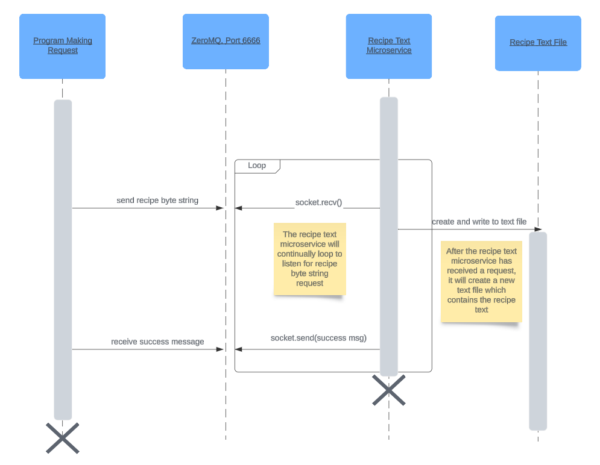

# **Recipe Text Microservice**

This microservice will use the ZeroMQ reply/request pattern for communication

This service will take in as input a byte string of a recipe and save it as a text file.
The service will also return a success message to the caller after the text
file has been created.

## **How to programmatically request data:**

To request data from this service please make sure you initiate a connection to
port 6666.

A byte string should be formatted in the following way:

b\<recipe name\>\:\<the rest of the recipe string\>

The "b" above is to indicate a byte string. Also, make sure to enclose the string in double quotes

Please ensure the recipe name is immediately proceeded by a colon. The string
before the colon will be taken as the recipe title and this title will
be the name of the text file. For example, \<recipe name\>.txt

Please request data from the service by the following call:

socket.send(<byte_string>)

The file client.py in this repository gives an example of how to 
programmatically request data from the service in further detail.

## **How to programmatically receive data:**

To receive data from the service issue the following call:

socket.recv()

The message received should be a success message from the service. In addition, 
the service should have successfully saved a text file of the recipe string 
that was sent in as a request to the service.

## **UML Diagram:**

    

